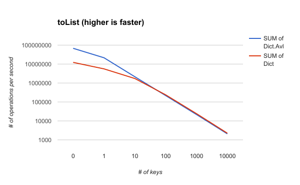
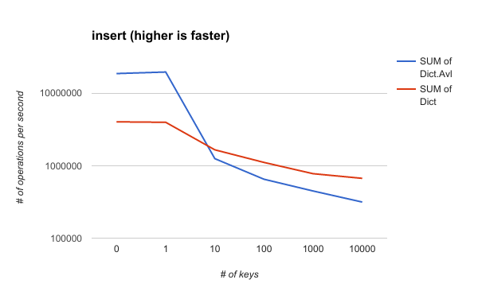
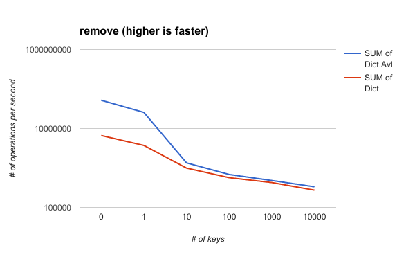

# Elm AVL Exploration 

A drop-in reimplementation of Elm's [`Dict`](http://package.elm-lang.org/packages/elm-lang/core/latest/Dict) and [`Set`](http://package.elm-lang.org/packages/elm-lang/core/latest/Set) using [AVL trees](https://en.wikipedia.org/wiki/AVL_tree) instead of [red-black trees](https://en.wikipedia.org/wiki/Red%E2%80%93black_tree).

## Quick Start

1. `elm package install BrianHicks/elm-avl-exploration`
2. `import Dict.Avl as Dict` wherever you want to use AVL Dicts

## Why?

I wrote the original implementation [for a blog series on functional data structures](https://www.brianthicks.com/post/2016/11/13/functional-sets-part-1-construction/).
After I was done, I wondered how my implementation compared to core, speed-wise.

Short answer: it's about 20% faster for reads, but half as fast for writes.
If you know that you do a lot more reading than you do writing, especially on a small number of keys, this library will probably be faster than core.

Data from my machine is below. You can replicate by building `benchmark/Main.elm` and visiting the result in your browser.

### `get`

`Dict.Avl.get` is about 15% faster than `Dict.get`, on average.

### `toList`

`Dict.Avl.toList` is about 25% faster than `Dict.toList`, on average.
`toList` is implemented using `foldl`, which may be an indicator of performance there.
This advantage is mainly found on sets of 10 or fewer items.

### `insert`

`Dict.Avl.insert` is about half as fast as `Dict.insert`, on average.
This disadvantage is mainly found on sets of 10 or more items.

### `remove`

`Dict.Avl.remove` is about half as fast as `Dict.insert`, on average.
This disadvantage is mainly found on sets of 10 or more items.

## License

Elm AVL exploration is licensed under a 3-Clause BSD License, located at [LICENSE](LICENSE).
